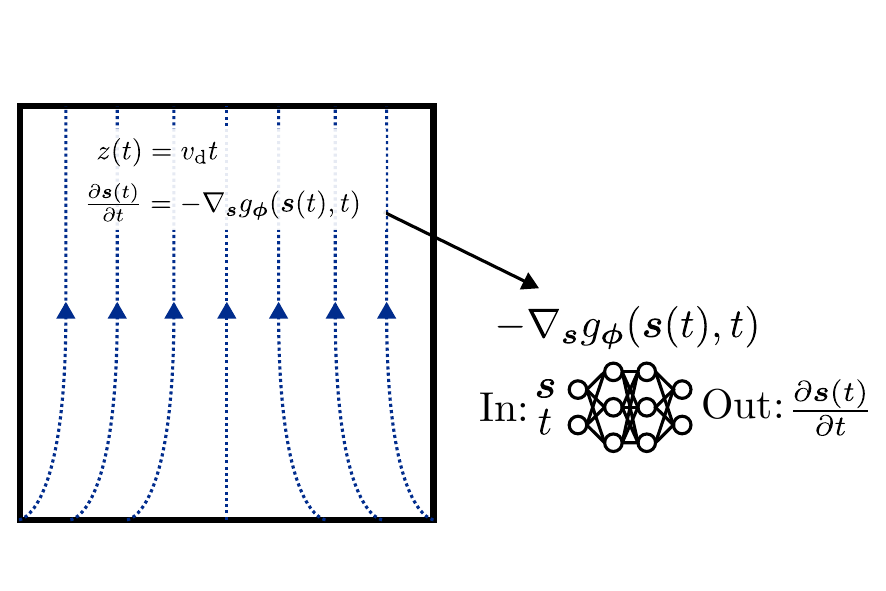

[](https://github.com/RiceAstroparticleLab/fieldflow/actions/workflows/lint.yml) [](https://github.com/RiceAstroparticleLab/fieldflow/actions/workflows/test.yml)

# FieldFlow

**Physics-informed continuous normalizing flows for modeling electric fields in time projection chambers**

FieldFlow is a JAX-based library implementing neural ODEs to learn the electric field transformation in time projection chambers directly from calibration data. The model enforces physical constraints (field conservativity) through its architecture to ensure a curl-free electric field. The flow can be used for correcting the field distortions when reconstructing particle interaction positions. Compared to traditional field distortion corrections in xenon TPCs, the flow can achieve comparable accuracy in position reconstruction while requiring fewer calibration events.

The library implements continuous normalizing flows with configurable ODE solvers, supporting both exact and approximate log probability computation. Multi-GPU training is supported with automatic data parallelization across devices.

## Paper

> **Physics-informed continuous normalizing flows to learn the electric field within a time-projection chamber**
> Ivy Li, Peter Gaemers, Juehang Qin, Naija Bruckner, Maris Arthurs, Maria Elena Monzani, Christopher Tunnell (2025)
> [arXiv:2511.01897](https://arxiv.org/abs/2511.01897) *(under review)*

## Key Features

- **Continuous normalizing flows** with exact or approximate log probability computation
- **Multi-GPU training** with automatic data sharding across devices
- **Configurable ODE solvers** including adaptive PID controllers
- **Fine-tuning support** for transfer learning from pretrained models
- **Position reconstruction** integration with pretrained flow models
- **JAX-based** implementation for GPU acceleration and automatic differentiation

## Installation

Requires Python ≥3.10. Install from source:

```bash
git clone https://github.com/RiceAstroparticleLab/fieldflow.git
cd fieldflow
pip install -e .
```

## Quick Start

Train a new model:
```bash
python -m fieldflow config.toml
```

Fine-tune a pretrained model:
```bash
python -m fieldflow config.toml --pretrained model.eqx
```

See the [documentation](https://riceastroparticlelab.github.io/fieldflow/) (in progress) for example usage details. Configuration options are documented in [`sample_config.toml`](sample_config.toml).

## How It Works

In a xenon TPC, ionization electrons drift through the detector under an applied electric field. Imperfections in this field distort the electrons' paths, so the positions measured at the top of the detector don't match where the interaction actually occurred. FieldFlow models the electric field and thereby can be used to correct these distortions.

**The model:** A continuous normalizing flow takes an interaction's transverse position (x, y) and time as input and outputs the dynamics of that position over drift time — where drift time maps directly to depth z inside the detector (z = drift velocity x time). Solving the neural ODE backward in time traces how a position gets distorted as electrons drift through the field; inverting it recovers the true interaction position.

**The physics-informed constraint:** Rather than learning the electric field directly, the neural network parameterizes the negative gradient of a scalar potential. This architectural choice guarantees that the learned field is curl-free by construction — this is based under the assumption of electrostatic fields in a TPC which do not vary significantly over time. Thus the physics is baked into the model architecture instead of enforced by a loss penalty as is typical in other physics-informed machine learning methods.

<p align="center">
  
</p>

<p align="center"><em>
Fig. 1: A position <b>s</b> inside the TPC evolves over drift time t, where depth corresponds to z(t) = v<sub>d</sub>t. The neural network learns a function g<sub>ϕ</sub> approximating a scaled scalar potential, and outputs −∇<sub>⊥</sub>g<sub>ϕ</sub> — the transverse gradient that governs how each position transforms as electrons drift. Because the dynamics are derived from a scalar potential, the resulting field is guaranteed to be curl-free.
</em></p>

## Project Structure

```
fieldflow/
├── src/fieldflow/       # Core library (flows, ODE solvers, training)
├── tests/               # Unit tests
├── sample_config.toml   # Example training configuration
├── USAGE.md             # Detailed usage guide
└── pyproject.toml       # Package metadata
```

## License

MIT License. See [LICENSE](LICENSE) for details.

## Issues & Contact

Report issues at [GitHub Issues](https://github.com/RiceAstroparticleLab/fieldflow/issues).
